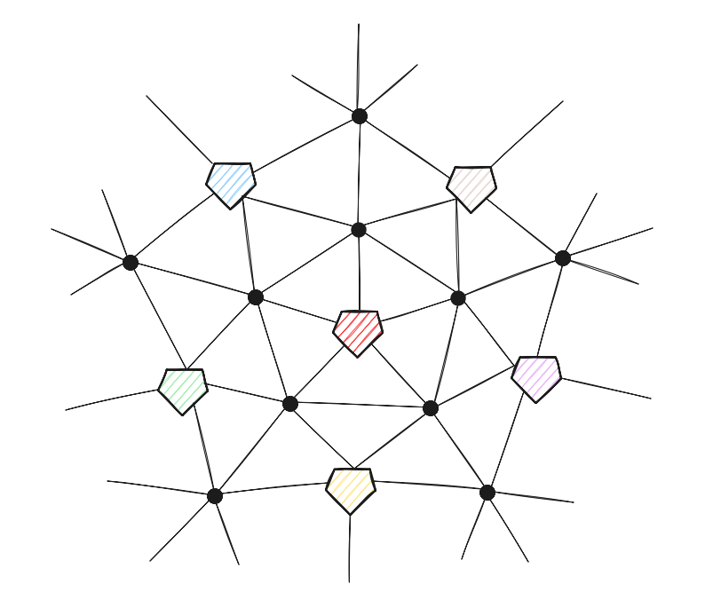
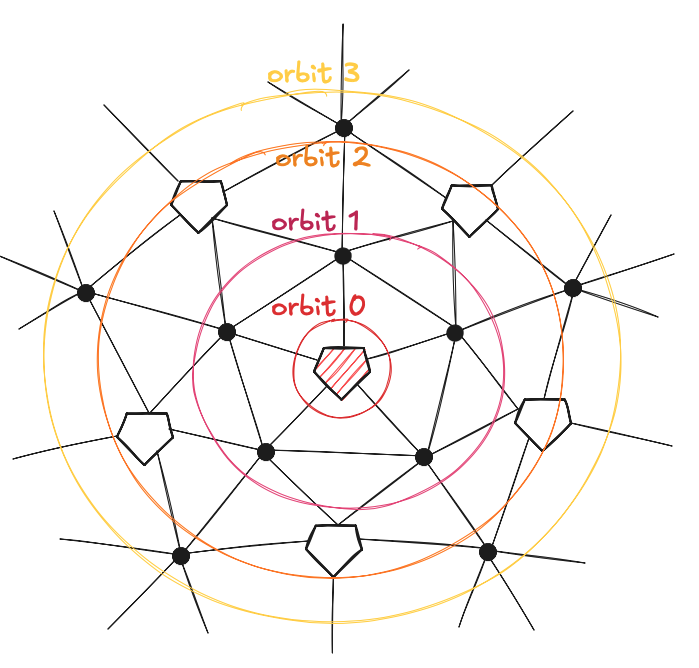
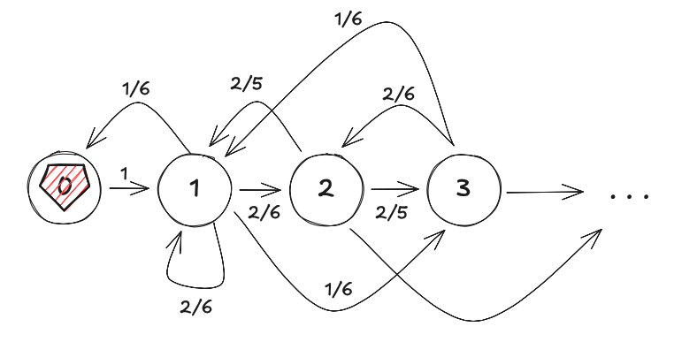

### 1. The problem (and the solution)

This is a puzzle on 3Blue1Brown's talent page posted by Jane Street. It's uncharacteristically easy for JS, being pretty much a textbook ergodic Markov chain problem. Essentially all it takes is to observe this is a symmetric random walk on a finite undirected aperiodic graph (the pentagons and hexagons are the vertices), which immediately makes it an ergodic Markov chain with a fairly simple transition kernel. The Fundamental Theorem of Markov chains gives us $\pi(x)=1/E_{x}[T_{x}]$, where $\pi$ is the unique stationary distribution and $E_{x}[T_{x}]$ is the mean recurrence time of state $x$ (exactly what we want); $\pi$ being the 1-eigenvector of the Markov kernel $M$, i.e., satisfying $\pi M=\pi$.

With this it is easy to see how the mean recurrence time can be computed, all it really takes is to fill in the 32x32 transition matrix and use any sort of linear algebra computation tool to find the eigenvector. But it is actually even simpler than that.

### 2. And the other part
What's cool here is that the graph is not only undirected and unweighted, but also highly structurally symmetric. If we begin in the red pentagon in the picture and take two steps to the purple pentagon, it is the same as being in any of the 4 other colored pentagons that are 2 steps away from red. 

All we need to notice here is that the football graph is "radial", consisting of concentric layers around the origin. 

Here's the trick: call $F=(V,E)$ the graph (for football) and let $\text{Aut}(F)$ be the automorphism group of the graph. A graph automorphism is a function $f:V\rightarrow V$ that preserves vertex adjacency, i.e. $\{v_{1}v_{2}\}\in E\Rightarrow \{f(v_{1})f(v_{2})\}\in E$. In other words, such a function simply relabels the vertices, maintaining the structure of the graph.

$\text{Aut}(F)$ consists of all such functions, but for our purposes we only need some of them. 
We will take $G_{0}=\text{stab(0)}\leq \text{Aut}(F)$ to be the stabilizer subgroup of $0$ (the origin pentagon vertex). What this means is any $f\in G_{0}$ is an automorphism of the graph that fixes the origin in place. The desired consequence of this is that it also fixes the relative distances of all vertices to the origin, since the adjacencies are preserved. 

For instance, consider the hexagon vertex between the red, blue, and green pentagon vertices on the image above; call this point $w$. An $f\in G_{0}$ must fix the origin, so $f(\text{red})=\text{red}$, but the preservation of adjacencies means that $f(w)$ is linked to $\text{red}$ under the automorphism, so $w$ must be mapped to one of the $5$ neighboring vertices around $\text{red}$. In other words, under such a relabelling, $w$ remains in the same layer.

With this, we consider the orbits of the action of $G_{0}$ on $F$: two vertices $v_{1},v_{2}$ are in the same orbit if $\exists f\in G_{0}\text{ s.t. }f(v_{1})=v_{2}$. As we see in the example above, the group action cleanly partitions the vertices of the graph into these orbits based on the "layer" they're in away from the origin.

It's kinda cute that in this graph, due to the radial structure, the group action orbits are literal orbits around the origin vertex.

We can finally collapse the graph by factoring out the symmetries and obtain the resulting Markov chain $F/G_{0}$. What we have done, essentially, is reduce the chain on the original graph (the surfaces of the football) to a chain on orbits under radial symmetry.

There are in total 8 orbits, with each having 5 vertices, except for 0th and 7th, which have only 1.

### 3. Conclusion
This reduces our 32x32 transition matrix to an 8x8 one basically for free! The $F/G_{0}$ chain gives us an easy eigenvector calculation (the answer to the puzzle is $E_{0}[T_{0}]=14$ btw). Of course, the initial problem has a small enough state space that it is not difficult at all to solve it directly (we only save on time inputting the matrix), but it is clear that on a large Markov chain a symmetry-exploiting simplification like this can reduce the required compute by orders of magnitude. 
