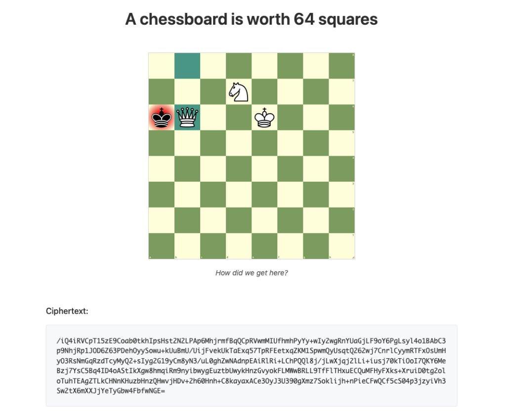
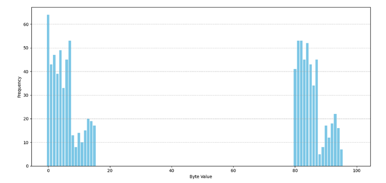
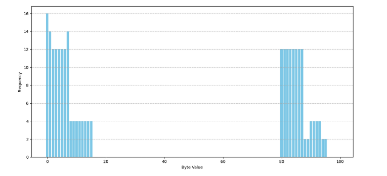

### Intro: 
This is a write-up of my solution to the Chess challenge from the HackMIT_2025 entry CTF contest. This challenge was the highlight of the contest for me, but not by design. The actual intended solution was fairly unremarkable and dull. What made this fun, however, was the fact that it did not work. I'm serious, the challenge was broken. It took them about a week to review the complaints and drop a patch.

The reason the organizers took so long to double-check this challenge and find the bug was because they saw that one person has solved it -- me, as it happens. The authors designed the solution to be a long clue chase that step by step led the players to decrypt the flag in the last part of the message, but an error made somewhere in the middle of the process made that flag unreachable. So, instead of following a trail of hints that led nowhere, I ended up cracking the encryption scheme itself and reconstructing the flag byte by byte. This solve won me first blood on a broken challenge, secured the leaderboard, and even got me a cheating accusation, which may have been worth more.

### Description

### Solution:

In this challenge, we are given a ciphertext, as well as a chessboard .png in mate position that contains a hidden chess game PGN. We will not be using that; rather, we observe that the last 64 bytes of the 383-byte text are unique and determined by the userID[^1]. It is assumed that the userID is hashed to produce the flag, with the bytes of the output being i.i.d. and uniform. We create 30 GitHub accounts, log in through them, and collect the associated ciphertexts.

Since only the last 64 bytes ever change, we predict it is a 1-to-1 cipher that individually maps each byte of the plaintext to a byte of the ciphertext. 
Then $\exists K$ with $pt_{i}[j]\oplus K[j] =ct_{i}[j]$ for all byte indices $j \in [0,63]$ for all userIDs $i\in [0,30]$.[^2]
The challenge is reduced to solving a many-time pad.

We observe further that for any fixed $j\in[63]$, for all $i_{1},i_{2}\in [30]$, 
$$ct_{i_{1}}[j] \oplus ct_{i_{2}}[j]=pt_{i_{1}}[j]\oplus pt_{i_{2}}[j]\in [\text{0x00, 0x0f}] \cup [\text{0x50,0x5f}].$$

[^1]: The hint for this is in the webpage's ciphertext retrieval endpoint.
[^2]: This makes the assumption that the encryption scheme can be expressed as a XOR against some consistent implicit key. It would not be true in, for example, a permutation cipher. I suspected the moves in the chess game were used as the encryption key, which would satisfy this. The next observation effectively confirmed it, as the common key was being cancelled out in the XOR.

This is the distribution of XORed bytes:

Let $H=[\text{0x00, 0x0f}]\cup [\text{0x50, 0x5f}]$ be a subgroup of $([\text{0x00, 0xff}],\oplus)$. Then for each fixed index $j$, $pt_{i}[j] \in g_{j}H$, the coset associated with that index formed by "shifting" $H$.
This limits the set of values from which $pt_{i}[j]$ bytes are drawn to 32. Next we identify the specific set, and show that it is the same for all $j$, and in fact smaller than the full coset.

In other challenges, the flag has length of 32 bytes, or 64 hex digits. We claim that in this chall, the generated flag is viewed as a string directly, and then encoded into bytes. As a result, each byte is the encoding of a hex digit, of which there are only 16. Consider the distribution of pairwise XORs of the byte encodings of hex digits:

This empirically shows that for all $j$, the set of potential bytes is the encodings of the hex digits. Let this set be called $S$.

For the last step, we construct a XOR-SAT problem, finding valid values of $K$ under the constraints:
$$K[j]\in \bigcap^{n}_{i}\{ct_{i}[j]\oplus s|s\in S\}.$$
 As more non-repeating ciphertexts are given, the intersection tightens. A solver like z3 is able to efficiently find valid keys, but how much data is required for strong constraints? We can estimate the number of ciphertexts needed to converge to a manually searchable keyspace.[^3]

I will drop indices to consider a single a.b.f byte of the key $k$. 
Let: 
$$
\begin{align*}
&A_{n}=\bigcap_{i}^{n}\{ct_{i}\oplus s | s \in S\} \\
&B_{n}=\{a\oplus k | a\in A_{n}\}=\bigcap_{i}^{n}\{ pt_{i}\oplus s|s\in S \}\\
\end{align*}
$$
Observe that, given the solvable key exists, $0\in B_{n}$, since $pt_{i}\in S$. We will have solved the problem when only $0$ remains in $B_{n}$, and all the other values have been eliminated. Define the random variable that gives us the smallest satisfying $n$:
$$X=\inf\{n|B_{n}=\{0\} \}$$

We will estimate $P(X>n)$, the tail probability. Consider a fixed $y$. What is $P(y\in B_{n})$, the probability that $y$ is not eliminated in $n$ ciphertexts? Since we assume the bytes of the plaintexts to be independent, then $P(y\in B_{n})=P(y\in B_{1})^{n}$. Observe following about the event $\{y\in B_{1} \}$:
$$
\{y\in B_{1}\} \iff \{\exists s \in S, pt=y\oplus s \} \iff \{ pt\in y\oplus S= \{y\oplus s |s\in S\}  \}.
$$
Recall that $pt\in S$. Then: $P(pt\in y\oplus S)= \frac{|S\cap y\oplus S|}{|S|}$. For convenience, define $f_{\oplus}$, the "autocorrelation" function between $S$ and the XOR-shifted $S$ by $f_{\oplus}(y)= |S\cap y\oplus S|$.
Then for all $y$, 
$$P(y\in B_{1})= \frac{{f_{\oplus}(y)}}{|S|}, \text{ and } P(y\in B_{n})= \left( \frac{{f_{\oplus}(y)}}{|S|} \right) ^{n}.$$

Finally:
$$
\begin{align*}
P(X>n) &= P \left( \bigcup_{y\neq 0} \{y\in B_{n}\} \right) \quad \text{some y is not eliminated}\\
&\leq \sum\limits_{y\neq 0} P(y\in B_{n}) \qquad \text{  by sigma-additivity}\\
&= \sum\limits_{y\neq0} \left( \frac{{f_{\oplus}(y)}}{|S|} \right)^{n} \\&= \frac{255}{|S|^{n}} \sum\limits_{y\neq0}f_{\oplus}(y)^{n}
\end{align*}
$$
The outcome depends on the structure of $f_\oplus$, which is in turn determined by the contents of S. A fun consequence of $S\subset gH$ is that $f_{\oplus}(y)>0 \iff y\in H$. The proof is an exercise for the reader. [^4] In practice, this means the distribution of $f_{\oplus}$ is heavily skewed towards 0, giving us a relatively small value in the sum.

$$
\begin{align*}
E[X]&=\sum\limits_{n=0}^{\infty} P(X>n)\\
&= P(X>0)+P(X>1) + \sum\limits_{n=2}^{\infty} P(X>n)\\
&\leq 2+ \sum\limits_{n=2}^{\infty} \sum\limits_{y\in H\setminus0} (f_\oplus(y)|S|^{-1})^{n}\\
&= 2+\sum\limits_{y\in H\setminus0} \sum\limits_{n=2}^{\infty} (f_\oplus(y)|S|^{-1})^{n}\\
&= 2+\sum\limits_{y\in H\setminus0} \frac{(f_\oplus(y)|S|^{-1})^{2}}{1-f_\oplus(y)|S|^{-1}} \qquad \text{geometric series}\\
&=2+ \frac{31}{|S|^{2}} \sum\limits_{y\in H\setminus 0} \frac{f_{\oplus}(y)^{2}}{ 1-f_\oplus(y)|S|^{-1}} \\ 
&\approx 44.57 \quad \text{ciphertexts needed to reduce keyspace to 1.}
\end{align*}
$$

I used 30 ciphertexts to solve for the key, with $P(X>30)\leq 0.0387$. This is the probability an a.b.f. key byte fails to converge to a single value. Since all bytes are independent, the number of bytes that fail to converge out of 64 follows a binomial distribution $\text{Bin}(64, 0.0387)$, and has $E[\cdot]\approx 2.48$. In my actual case, 4 bytes failed to converge (with 2 candidate bytes each), giving 16 possible keys.

From there it is trivial to compute the flag by taking XOR with the key.

[^3]: I did the math post factum. At the time of solving, I simply generated new cts until it was few enough keys to brute force, but I was curious what the theoretical expected num of cts was, so I went back to solve for it afterwards.
[^4]: How it feels to write this 🔥✍️

