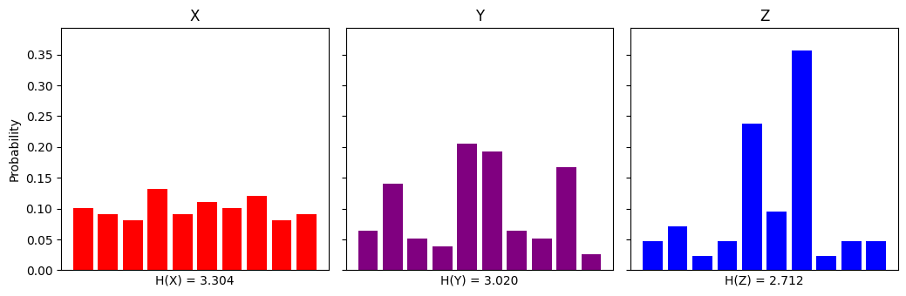
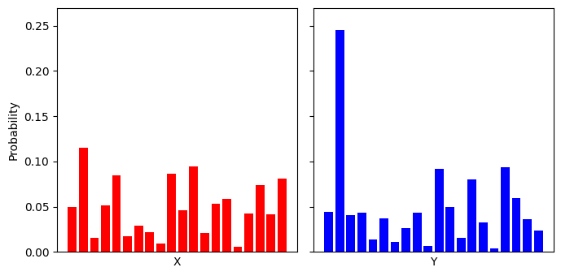
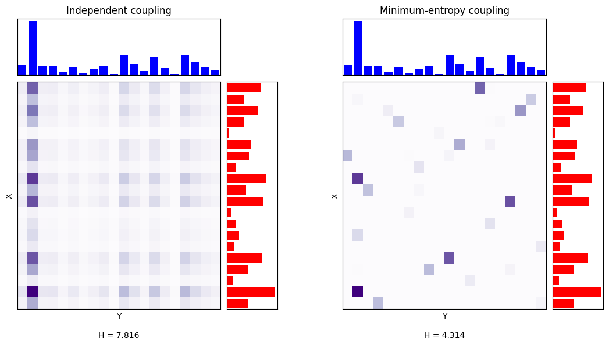
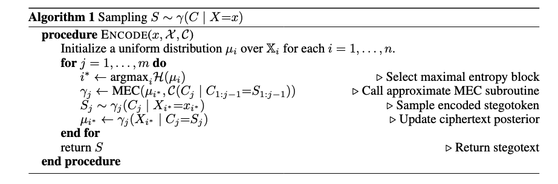
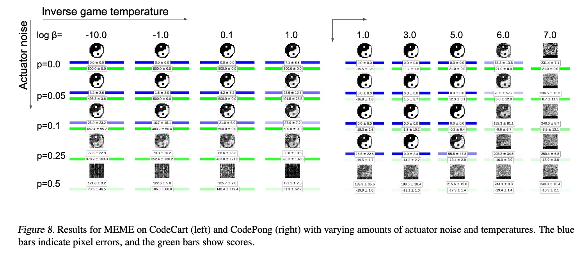

### Introduction
The field of steganography is concerned with hiding secret messages in innocuous-seeming data. It is a sort of dual to cryptography, but rather than encrypt the content of the message, one tries to conceal the message's presence in the first place. The primary instrument for detecting such concealments is statistical analysis - looking for patterns within data that should not be there, if it contained no secrets. This post and project is about an algorithm that is impervious to such attacks - it leverages an LLM to embed the secret within the choice of tokens, but its output is statistically indistinguishable from naturally generated text. 

This technique can also be used for the inverse task - marking LLM-generated text with a watermark embedded in the tokens themselves, rather than any metadata. Not too long ago, Anthropic introduced this feature into their models. If they relied on this algorithm, they can provably claim this will not affect their models' performance.

Another property of this encoding is that it is maximally efficient from the perspective of information theory: it takes the fewest tokens per bit of information. And more broadly, this algorithm can be used to encode data efficiently in other mediums, such as images and sample paths of RL agents.

This post is an overview of this idea, its applications, and some of the implementation logic. It is partially technical but not fully rigorous; my aim is to give an actionable introduction. Material from the following papers is adapted here: [^1] | [^2] | [^3] | [^4] |.

Finally, I built a live demo you can use to try this method out: https://cover.markovian.net! Here's also my implementation of the algorithms described in this post: https://github.com/saan-volta/Cover.

---
### 1. The problem setting

#### What is perfect secrecy?
Our task is to embed a message within a random signal without disturbing its statistical properties. We define $\mathbb{C}$ to be the space of *covertexts* - data which we will use for, well, cover, and $\mathbb{M}$ is the space of messages which we might want to encode. To reason about statistical properties, we define $\mathcal{M}$ to be the distribution of messages and $\mathcal{C}$ to be the distribution of true covertexts (over $\mathbb{C}$). For example, if we want to embed a message within text data, we'll use a cover distribution that captures typical patterns of natural language. Meanwhile, we denote with $\mathcal{S}$ the distribution (also over $\mathbb{C}$) of *stegotexts*: pieces of data which appear as covertexts, but in fact contain a hidden message. So the encoding is is a (randomized) map $f:\mathbb{M}\leadsto \mathbb{C}$, converting a message into a piece of stegotext (existing in the space of covertexts). 

Intuitively, we achieve perfect secrecy when $\mathcal{C}$ and $\mathcal{S}$ are identical, i.e. have KL-divergence zero. Another, more technical way of saying it is when
$$E_{M\sim\mathcal{M}}\bigg[P(f(M)=c)\bigg]=\mathcal{C}(c).$$
This says that on average, the probability that the random message $M$ encodes to stegotext $c$ is equivalent to the probability of $c$ appearing as an innocuous covertext. 

#### Information and uncertainty
We are also concerned with the *encoding efficiency* of our scheme: the amount of covertext data needed to embed our message. To quantify this, we introduce several definitions from information theory.

Let $X$ be a random variable. Then its entropy is $H(X)=-E[\log p_{X}(X)]$, where $p_{X}(x)=P(X=x)$.
If $X$ is discrete, this is equivalently $H(X)=-\sum_{x}p_{X}(x)\log p_{X}(x)$.


Entropy is the measure of chaos of a random variable; it is increased with the unpredictability of its outcome.

The highest entropy is achieved in the uniform distribution (any outcome is equally likely), and the lowest (zero) in the Dirac delta distribution $\delta_{x}$, where the entire mass is concentrated on the single point $x$ (the outcome is fully predictable).

We consider similarly the *joint entropy* on a vector of random variables
$$H(X,Y)=-E[\log p_{X,Y}(X,Y)]$$
and the *conditional entropy* $H(X\mid Y)$ as the uncertainty of $X$ conditioned on the realization of $Y$. These two forms are tied by the identity
$$H(X,Y)=H(X)+H(Y\mid X)=H(Y)+H(X\mid Y).$$
There's one more definition we need to state our objective.

Let $X,Y$ be random variables. Then $I(X;Y)=H(X)-H(X\mid Y)$ is the mutual information between $X$ and $Y$, and the expected amount of uncertainty about $X$ eliminated by knowing $Y$.


Combining these formulae, we get
$$I(X;Y)=H(X)+H(Y)-H(X,Y).$$
Then the core principle is this: if we want to maximize the mutual information between the two variables, we must minimize the joint entropy $H(X,Y)$. This is our only option since the marginal entropies $H(X)$ and $H(Y)$ are not modifiable.

In the context of steganography, to achieve maximal encoding efficiency, we aim to increase $I(M;S)$, where $M$ is the secret message and $S$ the stegotext; this will give us the best ratio of bits encoded per output token. In effect, this is a measure of compression. But how do we optimize it?

---
### 2. The MEC
The point and crux of the algorithm we will examine is in the concept of *minimum-entropy coupling* (MEC). In a sentence, it's a constructed joint distribution with the lowest $H(\cdot,\cdot)$ measure. More concretely:

Let $X\sim\mathcal{X}$ and $Y\sim\mathcal{Y}$. A *coupling* of $\mathcal{X}$ and $\mathcal{Y}$ is a joint distribution $\gamma(\cdot,\cdot)$ that maintains the marginals of $X$ and $Y$. That means for all values $x$ of $X$
$$\sum\limits_{y}\gamma(x,y)=\mathcal{X}(x),$$
and for all values $y$ of $Y$ 
$$\sum\limits_{x}\gamma(x,y)=\mathcal{Y}(y).$$
Note that in general there are many coupling with set marginals; we use $\Gamma(\mathcal{X,Y})$ to denote their set. The *minimum-entropy coupling* is the coupling $\gamma^{\star}\in\Gamma(\mathcal{X,Y})$ such that $\forall \gamma\neq \gamma^{\star}$, we have $H(\gamma^{\star})\leq H(\gamma)$. In other words, it is the coupling with the smallest joint entropy.


Let's see an example. Here are two variables $X$ and $Y$ with their corresponding marginal distributions:

A trivial example of coupling is the *independent coupling*, defined as $\gamma(x,y):=\mathcal{X}(x)\cdot\mathcal{Y}(y).$

For both of these produced couplings, the sum along each axis is the corresponding marginal. However, the right one is "packed more tightly" and has far less noise. The coupling minimizes the mutual information between $X$ and $Y$ by more than 3 bits over the independent.

Where did I get this second joint distribution? The underlying MEC algorithm I used here is developed in (Kocaoglu et al, 2016). This algorithm is actually approximate as this problem is considered NP-hard. The actual implementation of it is beyond the scope of this post, but one element of note is that this paper considers this task is a completely different context - it is about the problem of inferring causal relationship between random variables based on observed data.

But what does this have to do with steganography?

---
### 3. First of its kind
Here we arrive at the first key contribution of (Schroeder de Witt, 2023).

A steganographic encoding procedure $f:\mathbb{M}\leadsto\mathbb{C}$ is induced by a coupling $\gamma\in\Gamma(\mathcal{M},\mathcal{C})$, where $\mathcal{M,C}$  are respectively the distributions of messages and covertext, if for all $m\in\mathbb{M}$ and $c\in\mathbb{C}$
$$P(f(M)=c)=\gamma(C=c\mid M=m).$$


A note on what $\gamma(C=c\mid M=m)$ means: since $\gamma$ is a joint distribution of $(M,C)$, this can be visualized as taking row $m$ of the joint matrix, normalizing it to a probability distribution, and finding the probability value at index $c$.


1. A steganographic encoding procedure is perfectly secure if and only if it is induced by a coupling.
2. Among encoding procedures that are perfectly secure, a procedure maximizes the mutual information $I(M;S)$ if and only if it is induced by a minimum-entropy coupling.


These two proofs in the paper are remarkably concise. The best way I could show them would be to copy it line for line, but I will not do that.

So this is what we want - a way to produce a coupling between the distributions of covertext and the message space (for the moment, both of them being natural language). However... this is somewhat tricky. The MEC algorithm can couple two explicitly-defined discrete distributions with relatively small supports, but $\mathcal{C}$ and $\mathcal{M}$ are incredibly complex. How does one couple the distributions over all sequences of natural text?

The second contribution the authors present is the algorithm to produce an implicit coupling between a **factorable uniform distribution** and a **distribution specified autoregressively**. The trick is this: given a message $m$, we XOR it with a random key to obtain $X:=m\oplus K$, which is distributed uniformly. We then partition it into $n$ blocks of $b$ bits each, so $X=(X_{1},...,X_{n})$. Meanwhile, we take $\mathcal{C}(\cdot\mid c_{1},...,c_{j})$ as the distribution of the next token (word) conditioned on a context of length $j$; this distribution is specified by a large language model, which we will assume to accurately represent natural text. The greedy algorithm, called Iterative MEC, is this:

Here's what this does in plain terms. We maintain a list of distributions $\mu_{1},...,\mu_{n}$, each for a block $X_{i}$. At each iteration, we fetch the block with the highest entropy, couple it to the distribution of the next token $\mathcal{C}(C_{j}\mid \;...)$ using the simple MEC procedure, and emit the next stegotext token conditional on the actual value of $X_{{i}^{*}}$, and finally update the corresponding distribution. This procedure ends when all $\mu_{i}$ collapse to the deterministic single-point distribution $\delta_{x_{i}}$ - as they are initialized to uniform, observe that they transform from the highest- to the lowest-entropy distribution. At the end, we receive a sequence of stegotext tokens $(S_{1},...,S_{m})$; the length $m$ is exactly how many iterations it takes to eliminate all uncertainty from all the blocks $\set{\mu_{i}}_{n}$. In essence, this algorithm manipulates the choice of tokens at each step, but the actual distribution of the generated text is not changed as it is an encoding induced by a coupling.

To decode, essentially the exact same algorithm is run - the tokens $\set{S_{j}}_{m}$ are consumed to similarly update the block distributions $\set{\mu_{i}}_{n}$ until they converge to the zero entropy Dirac deltas. Then, we simply sample from them in order to reconstruct $\set{\hat{x}_{i}}_{n}$, the estimation of the keyed message, and finally XOR with the key again to recover $m$.

---
### 4. Other applications
The iMEC method is not limited to text data. In place of the LLM-given $\mathcal{C}(\cdot\mid c_{1},...,c_{j})$ next-token-based-on-context distribution, one could similarly encode data within audio and images. A particularly cool medium expplored in (Sokota et al., 2022) is encoding a message within the sample trajectory of a reinforcement learning agent in a Markovian decision process:

A more LLM-oriented application is watermarking: certifying that a piece of data was generated artificially by embedding a signature in the tokens themselves. In this case, the performance of the model will provably be unaffected.

More broadly, MEC is applied in entropic causal inference: given two random variables $X,Y$, determining whether there exists an outside variable $E$ such that $Y=f(X,E)$, i.e. there exists a deterministic function implying causal direction from $X$ to $Y$. It is intuitive that if this is so, the entropy in the true causal direction will be small. Furthermore, the optimal coupling should be able to identify $E$. The authors of (Cicalese at el, 2019) explore some other applications of this method, as well as develop a MEC algorithm that approximates the true minimum-entropy coupling with error margin of 1 bit.

[^1]: Schroeder de Witt et al., 2023: https://arxiv.org/abs/2210.14889
[^2]: Sokota et al., 2022: https://arxiv.org/abs/2107.08295
[^3]: Cicalese et al., 2019: https://arxiv.org/abs/1901.07530
[^4]: Kocaoglu et al., 2016: https://arxiv.org/abs/1611.04035v2 
